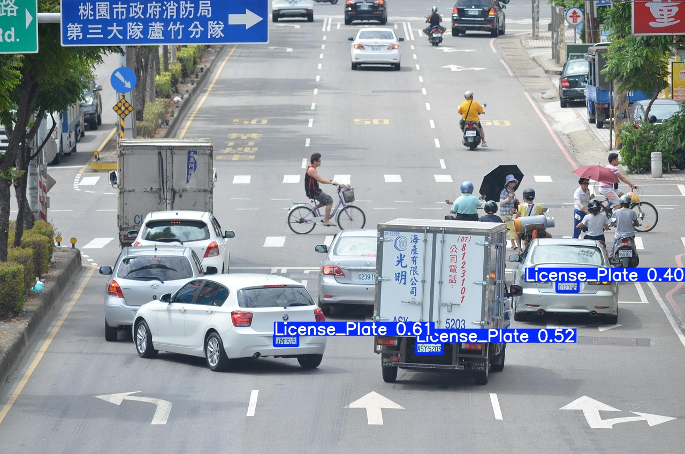
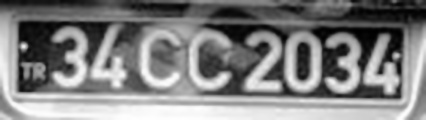
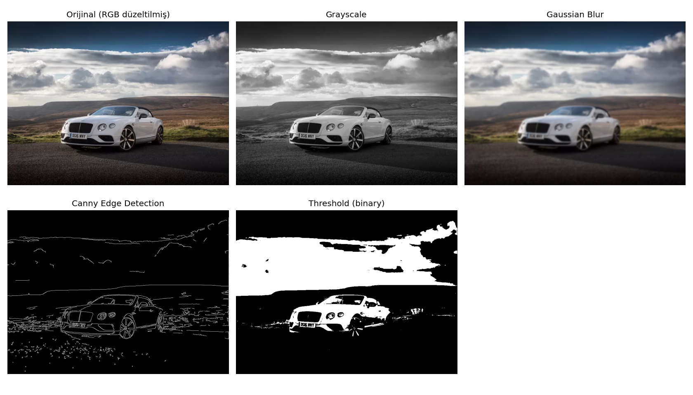

# Görüntü İşleme & ANPR Pipeline

OpenCV temellerinden başlayıp uçtan uca otomatik plaka tanıma (ANPR) sistemine uzanan bir öğrenme ve uygulama projesi.

## Demo

### Plaka Tespiti (YOLOv8 fine-tuned)

*3 plaka tespit edildi — güven skorları: 0.61, 0.52, 0.40*

### OCR ile Plaka Okuma

*Ön işleme sonrası EasyOCR çıktısı: `34CC2034` — OCR güven: 0.80*

### Görüntü İşleme Temelleri (OpenCV)

*Orijinal → Grayscale → Gaussian Blur → Canny Edge Detection → Threshold*

## Proje Akışı

| Script | İçerik |
|---|---|
| `01_goruntu_temelleri.py` | OpenCV temelleri: BGR/RGB, grayscale, Gaussian Blur, Canny kenar tespiti, thresholding |
| `02_arac_tespiti.py` | YOLOv8n (COCO pretrained) ile araç tespiti ve sınıf filtreleme |
| `03_cnn_mnist.py` | PyTorch ile sıfırdan CNN mimarisi, MNIST üzerinde eğitim |
| `04_finetuning.py` | YOLOv8n'i Roboflow plaka veri setiyle fine-tune etme (25 epoch) |
| `05_model_test.py` | Fine-tune edilmiş modeli test görüntüsü üzerinde çalıştırma |
| `06_plaka_okuma.py` | Tam ANPR pipeline: plaka tespiti → kırpma → ön işleme → EasyOCR |

## Kurulum

```bash
pip install -r requirements.txt
```

API anahtarı için `.env` dosyası oluştur:

```
ROBOFLOW_API_KEY=your_key_here
```

## ANPR Pipeline Detayı

`06_plaka_okuma.py` şu adımları uygular:

1. **Plaka tespiti** — Fine-tune edilmiş YOLOv8 modeli (`models/best.pt`)
2. **Kırpma** — Bounding box koordinatlarıyla plaka bölgesi izole edilir
3. **Ön işleme**
   - Grayscale dönüşüm
   - 3x büyütme (OCR küçük metinde zorlanır)
   - Histogram equalization (kontrast artırma)
   - Bilateral filter (gürültü azaltma, kenarları korur)
4. **OCR** — EasyOCR ile karakter okuma

## Model Sonuçları

### YOLOv8n — Plaka Tespiti (Fine-tuned)

| Metrik | Değer |
|---|---|
| Precision | 0.977 |
| Recall | 0.946 |
| **mAP50** | **0.969** |
| mAP50-95 | 0.687 |
| Inference hızı | 1.6ms / görüntü |

- Eğitim: 25 epoch, Tesla T4 GPU, ~55 dakika
- Veri seti: 7057 eğitim + 2048 validasyon görüntüsü
- Model: YOLOv8n (COCO pretrained → plaka fine-tune)

### SimpleCNN — MNIST Rakam Sınıflandırma

| Metrik | Değer |
|---|---|
| Test Accuracy | ~%99 |
| Mimari | 2x Conv + MaxPool + FC |
| Eğitim | 3 epoch, CPU |

## Kullanılan Teknolojiler

- **YOLOv8** (Ultralytics) — nesne tespiti ve fine-tuning
- **PyTorch** — CNN mimarisi ve eğitim
- **OpenCV** — görüntü işleme
- **EasyOCR** — karakter tanıma
- **Roboflow** — veri seti yönetimi
